# Introduction

## Dataset

The dataset consists of a simulated version of real card transactions from a financial institution's customers. Specifically, the dataset includes 786,363 transaction records. However, the original data is messy, with some variables having completely duplicated values or missing values. These variables are not significant for analysis. The missing value variables include echoBuffer, merchantCity, merchantState, merchantZip, posOnPremises, and recurringAuthInd, while the duplicated value variables includes accountNumber and customerId (which are exactly the same). I remove all missing value variables and customerId simply because entirely missing variables have no information at all. And eventually I have only 22 Variables to work with: 

| Variables                | Description                                                                                          | Type    |
|--------------------------|---------------------------|-------------------|
| customerId               | A unique identifier for the customer associated with the transaction.                                | int64   |
| creditLimit              | The maximum amount of credit available to the customer on their account.                             | float64 |
| availableMoney           | The amount of credit available to the customer at the time of the transaction.                       | float64 |
| transactionDateTime      | The date and time of the transaction.                                                                |         |
| transactionAmount        | the amount of the transaction                                                                        | float64 |
| merchantName             | The name of the merchant where the transaction took place .                                          | object  |
| acqCountry               | The country where the acquiring bank is located .                                                    | object  |
| merchantCountryCode      | the country where the merchant is located                                                            | object  |
| posEntryMode             | the method used by the customer to enter their payment card information during the transaction       | float64 |
| posConditionCode         | the condition of the point-of-sale terminal at the time of the transaction                           | float64 |
| merchantCategoryCode     | the category of the merchant where the transaction took place                                        | object  |
| cardCVV                  | the three-digit CVV code on the back of the customer's payment card                                  | int64   |
| enteredCVV               | The CVV code entered by the customer during the transaction.                                         | int64   |
| cardLast4Digits          | The last four digits of the customer's payment card                                                  | int64   |
| transactionType          | The type of transaction.                                                                             | object  |
| currentBalance           | The current balance on the customer's account                                                        | float64 |
| cardPresent              | Whether or not the customer'spayment card was present at the time of the transaction.                | bool    |
| expirationDateKeyInMatch | Whether or not the expiration date of the payment card was entered correctly during the transaction. | bool    |
| isFraud                  | Whether or not the transaction was fraudulent.                                                       | bool    |

The main objective of this assignment is to extract insights into the predictors of credit card fraud, a crucial issue in the financial industry.

# Data cleaning and preprocessing

## Dealing with missing values and outliers

I did the preliminary data quality checks, such as identifying duplicated columns and columns with entirely missing data. I found out that the first two row **accountNumber** and **customerId** are exactly the same. And columns with entirely missing data are: **echoBuffer**, **merchantCity**, **merchantState**, **merchantZip**,**posOnPremises**, **recurringAuthInd**. For the entirely missing data col and the entirely duplicated col, the best way is to delete all of them, since there are no useful information in them at all.

To find out outliers, I begin with finding out all the numeric variables in the current dataset (With dupulicated and entirely null columns deleted). And the numeric variables include **customerId**, **creditLimit**, **availableMoney**, **transactionAmount**, **posEntryMode**, **posConditionCode**, **cardCVV**, **enteredCVV**, **cardLast4Digits** and **currentBalance**. Since **customerId**, **cardCVV**, **enteredCVV** and **cardLast4Digits** are more like identity and I will deal with them later. 

Then I draw histogram plots on the rest numeric variables try to identify outliers. In order to make the outliers more obvious, I label the points with very low frequency (Otherwise they will be invisible in the plots). And we can see from the **figure 1** that most of the numeric variables have outliers. Based on my life experience, I'm going to do the analysis one by one then to decide how to deal with those outliers.

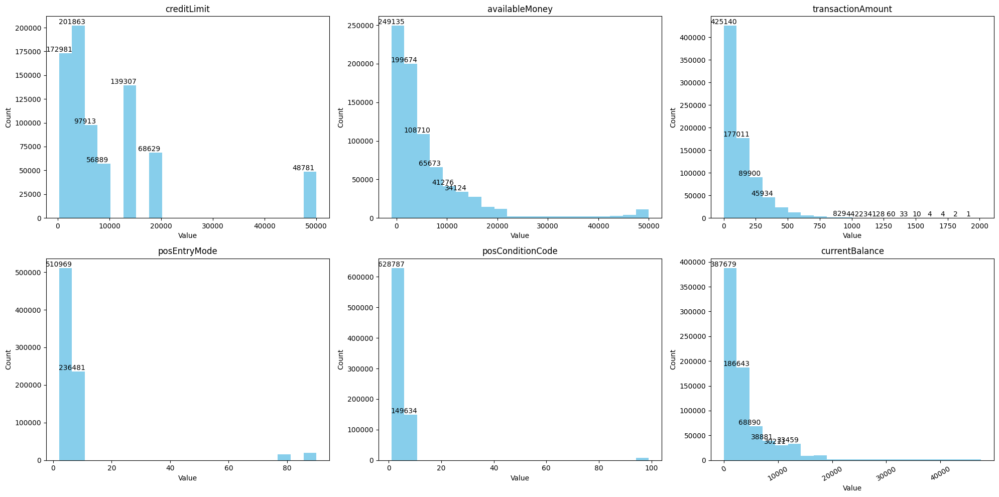{#id .class width="100%" height="50%"}

-   **creditLimit** : This variable represents the maximum credit limit that the customer has on their account. While the value of 50000 appears to be an outlier based on the plot, it is possible that in real life, the next level of credit limit beyond 20000 would likely be set at 50000. So I think we can keep the data and they shouldn't be thought as outliers.

-   **availableMoney**: This variable represents the amount of credit available to the customer at the time of the transaction. From the plot there might exist some outliers, but considering the creditLimit (creditLimit and availableMoney should be highly related), I think I only need to remove the value that is less than 0 and do nothing about values around 50000.

-   **transactionAmount**: This looks like an exponential distribution. Although there seems to be some outliers bigger than 1000. Considering in real life, such transactions happen but in a low frequency, which is align to my observation. I decide to keep all these rows.

-   **posEntryMode**: This refer to the method used by the customer to enter their payment card information during the transaction. There are some outliers also with value too different then the origin value. I decide to remove those values. 

-   **posConditionCode**: this refer to the condition of the point-of-sale terminal at the time of the transaction. There are some outliers also. Also the value is too far away from the majority so I decide to remove them. 

In sum , since the outliers I plan to delete are of small proportion, I plan to remove all the outliers in posEntryMode, posConditionCode and availableMoney.

Then I check each colume's missing value and find out **acqCountry** has 4172 NA, **merchantCountryCode** has 663 NA, **posEntryMode** has 4054 NA, and **transactionType** has 649 NA. My assumption is that the missing values are also important although their quantity is relatively small compared to the entire data set. In my opinion, some missing value might due to the unknown company or people, where fraud happens a lot. In order to make the analysis more accurate later, I fill all the NA with a new categorical value called "Missing" instead of dropping them, with the hope that I can find some information in those missing categories.

## Time variables and enteredCVV, cardCVV, cardLast4Digits

**transactionDateTime** now has the format looks like "2016-08-13T14:27:32", which is not in a regular format. I convert it from String to datetime format and add a new variable named **day_of_week** to show the week time of this transaction Date. I hope in future analysis I can find out more pattern like there might be more fraud event during weekends.

The data type for **enteredCVV**, **cardCVV**, and **cardLast4Digits** are all "int64". And normally, the length of **enteredCVV** and **cardCVV** should be both be three and also the same. Based on the plot above, it is evident that the histograms are not identical, implying that some individuals may have entered their CVV numbers incorrectly. To reflect this information, I  create a new column called **CVV_Match**, True when the CVV is input correctly, otherwise False.

Likewise, **cardLast4Digits** should be four digits. However, if the first or two digit is zero, the number of digits may change, so I will add extra zero and make sure all of them have 4 digits. Then I find out the range for the **cardLast4Digits** is between "0000" and "9998". I think **cardLast4Digits** is just like the id, has nothing to do with the fraud rate. Although not shown here, I draw the scatter plot of it and find out nothing special.

# Analysis and visualization

## Matched CVV and Fraud Rate

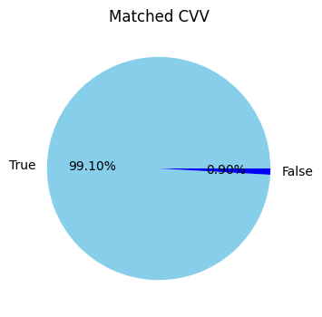{#class width="50%" height="30%"} 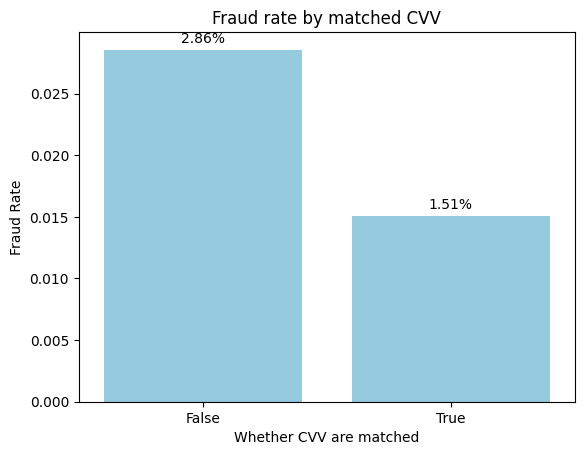{width="50%" height="30%"}

From Figure above, we can see when the CVV number is input correctly, there will be less Fraud rate. And most of the time, CVV number are matched, which takes about more than 99%.

## TransactionAmount follows Exponatial distribution

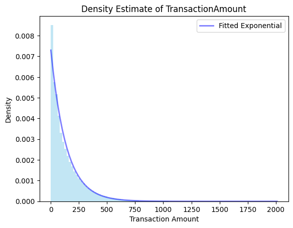{width="40%" height="40%"}

Next, I utilized a density plot to identify the trend and distribution of **transactionAmount**. As shown in **figure 2**. The plot indicates that the **transactionAmount** approximately follows an exponential distribution. Based on such finding, I try to fit the data with an exponential distribution. From the plot we can see that it is of great fit. Most transactions are small value, and the frequency of the value drops quickly as the value goes up. Moreover, we can use the fitted line to estimate the frequency of a specific amount.

## Fraut Rate over Categorical Data

Based on the week time, I made a new variable called **day_of_week**. I'm wondering if weekends will have a higher rate of getting fraud.

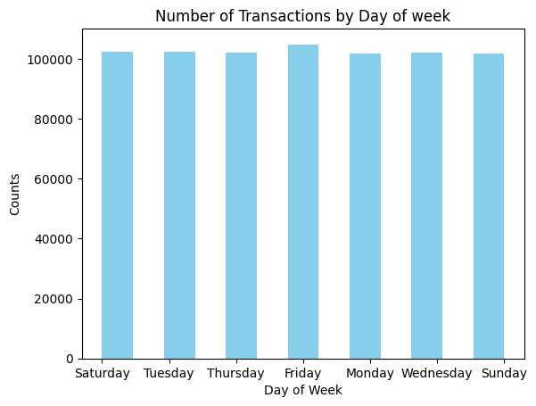{width="50%" height="50%"} 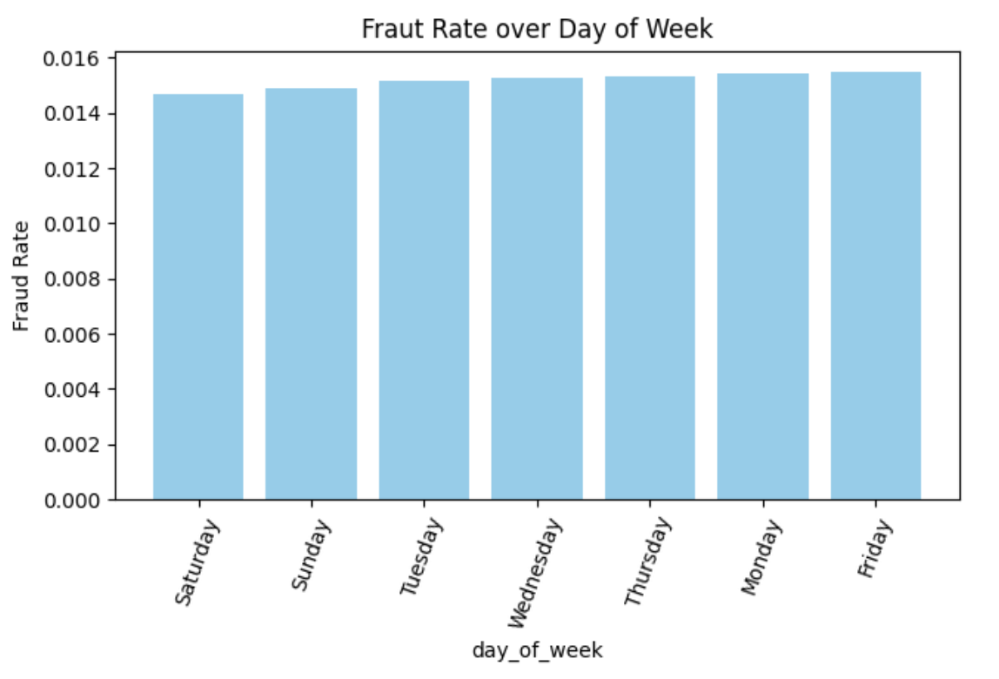{width="50%" height="50%"}

However, the result turns out to be opposite which is surprising: Although Monday to Sunday has almost similar fraud rate, the weekend's rate is slightly smaller than the weekdays. That is a surprising finding, because in my opinion, weekends should have more fraud activities.

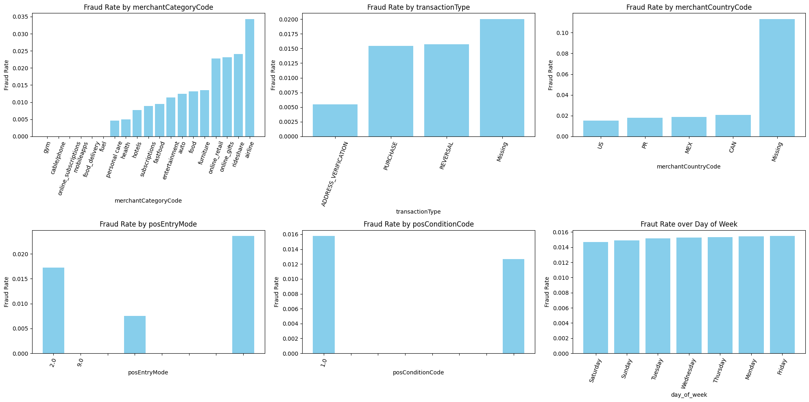{width="100%" height="100%"}

I futher investigated the categorical variables, namely **day_of_week**, **merchantCategoryCode**, **posEntryMode**, **transactionType**, **posConditionCode**, and **merchantCountryCode**:

Using bar charts and obtained Figure 3. Based on the results, I observed that the new variable I made **day_of_week** do not exhibit significant differences in **isFraud** across different categories. Note that **Missing** value in all categories have much higher fraud rate than the known type of resource. This is reasonable and in real life we can't transform the money to some unknown or unauthorized places. Therefore, I recommend including only **merchantCountryCode**, **merchantCategoryCode**, **posEntryMode**, **transactionType**, and **posConditionCode** as predictors in our model. A possible approach to incorporating these variables would be to use a decision tree algorithm such as CART.

Then I further explore the relationship between **isFraud** and **transactionType** conditioned on **merchantCategoryCode**. To better visualize the result, I sort the fraud rate from high to low.

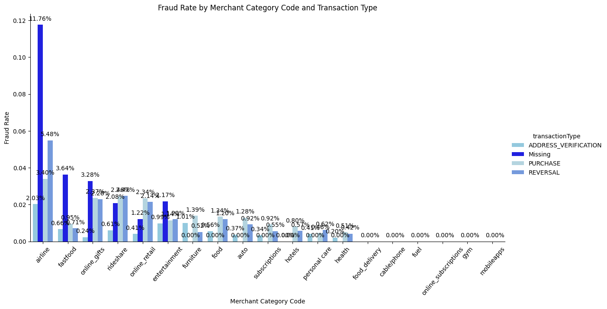{width="100%" height="100%"}

As shown in **figure 4**, among all **transctiontype**, **Missing** and **PURCHASE** seem to have higher fraud rate while **ADDRESS_VERIFICATION** is relatively safer. To stress again, **Missing** has much higher fraud rate, especially in airline code (More than 11%). And among all Merchant Category code, airline, online gift and rideshare seem to be the most dangerous while fuel food delivery and gym seem safe with none fraud rate. We all need to pay attention when the merchant type is airline and we can't transform money to unknown company.

## Distribution of important numerical variables condition on isFraud

Based on the data type table presented earlier, I have identified three other numerical variables : **creditLimit**, **availableMoney**, **transactionAmount**, and **currentBalance**. In order to visualize the distribution of fraudulent transactions and explore the relationship among these variables, I use the following plot(All fitted by Exponatial distribution):

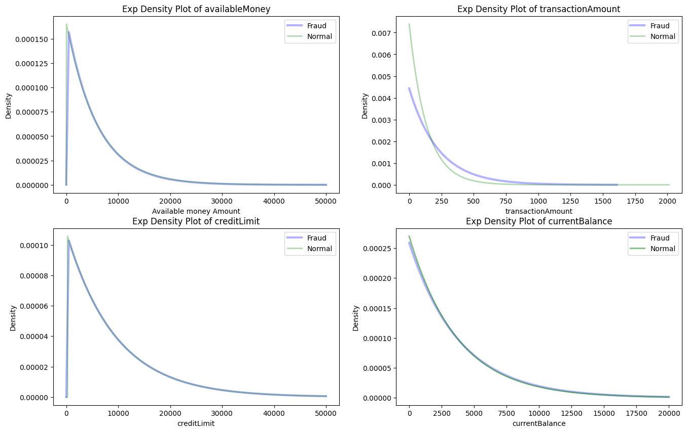{width="100%" height="50%"}

Based on the figure, it can be observed that fraud mostly occur in small transaction activities, also when the **availableMoney**, **creditLimit** and **currentBalance** variables are small. No matter whether fraud happens, all numeric variables seem to share the same distribution, which indicating that fraud happens randomly.

## Multi-swipe transactions

I implemented a method to identify multi-swipe transactions, which are transactions in which the same card or account is charged multiple times in a short time span for the same or similar amount. To do so, I set a time difference of 10 minutes and searched for transactions that occur more than once within this period for the same amount and excluded the first "normal" transactions from the data. In the end, out of 761368 samples, I identified 12066 as multi-swipe transactions.

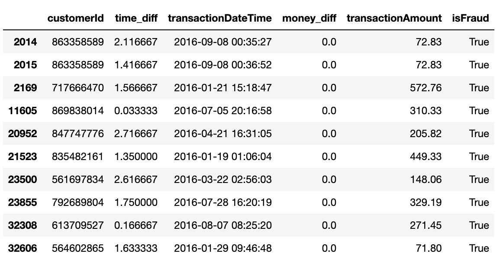{width="60%" height="60%"}

Upon further analysis, I observed a positive correlation between multi-swipe transactions and fraud, with around 1.8% are fraud from all the multi-swipe transactions while 1.5% are fraud from the entire activities. But since the samples for the multi-swipe is relatively small, we need more discussions on this conclusion. And I also realized that some people might get fraud for many time during the same span of time. I also tried to change the time span from 1-30 minutes to find some pattern of Multi-swipe transactions, and found Multi-swipe transactions increases through time span but stay almost fixed when time span is longer than 3 minutes. That is similar to my life experience that frequent transactions (same transactions within 3 minutes) should be careful.

## Imbalance problem

The distribution of **isFraud** is highly imbalanced in the data, with only 1.5% fraudulent transactions out of the total data set. This imbalance can have significant problems for developing predictive model, including: Because the model is trained on a much larger number of normal transactions, the trained model might fail to capture the information and pattern in the fraud transactions. So the predictive model might be more biased towards the majority class, which is the normal transactions in this situation. Let's imagine in future task, if I simply predict the outcome of isFraud to be False, I can still get a high level of accuracy (about 98.5%). As a result, we might ending up having the model have both high false positive rate and false negative rate. 

One method to deal with imbalance is oversampling, where we increase the number of data in the minority class to match that of the majority class. For this task, I will use the random oversampling method, which involves randomly selecting and duplicating instances from the minority class until it has the same number of samples as the majority class. To preform this, I use the **imblearn** package.

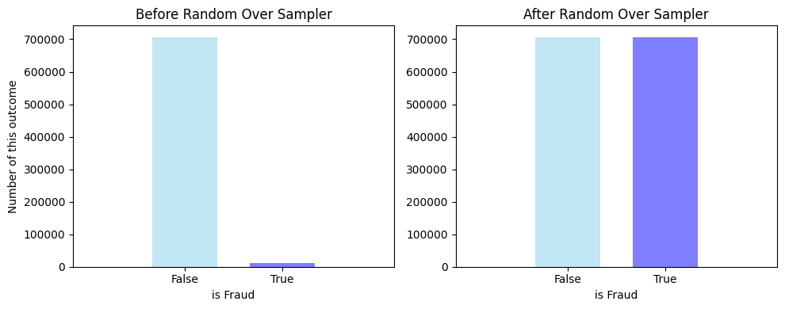{width="100%" height="100%"}

After applying the oversampling method, the distribution of the isFraud in the data set has become more balanced. I think this can have a positive influence on the predictive model's performance as it will help capture the fraud transaction patterns and information more. Often, with a more balanced data set, the false negative rate can be improved, which is critical in preventing financial losses due to fraud transactions in the future when the model is put to use. Overall, it is still important to evaluate the model's performance to ensure its accuracy and efficiency and I think the balanced data will be of better performance in future modeling.

# Summary

In this project, I performed the cleaning and analysis process before modeling. I first dealt with the missing values and outliers. In this project, it is important not to drop the missing values because they are of importance to future analysis. Afterwards, I utilized many visualization tools such as density plots and categorical data analysis to gain insights into the distribution of fraudulent transactions and identify potential instances of credit card fraud. For example, I used a density plot to find out that the frequency of the value dropped quickly as the value went up. And I used a histogram plot to show fraud rate is higher when people's cvv number are not matched. Importantly, in categorical data analysis part, I find out the missing category, which I referred as unknown company or unauthorized place, have much higher fraud rate compared with other categories. Later, in Multi-swipe transactions problem, I find out Multi-swipe is related with the fraud rate. But given that Multi-swipe sample is small, we need more analysis in the future. In the end, I discuss the imbalance problem of this data set and used oversampling method to deal with this problem. Our future work might include using a decision tree algorithm such as CART to predict isFraud based on the balanced data set.

# Working with others and reference

I share some of my idea on Multi-transaction and imbalance problem with Hejia Liu. And I used [**Plotly Document**](https://plotly.com/python/getting-started/#:~:text=Plotly%20is%20a%20free%20and,to%20some%20Basic%20Charts%20tutorials.), [**Pandas Document**](https://pandas.pydata.org/docs/), [**seaborn**](https://seaborn.pydata.org/). And my plot codes are modified based on their examples.
