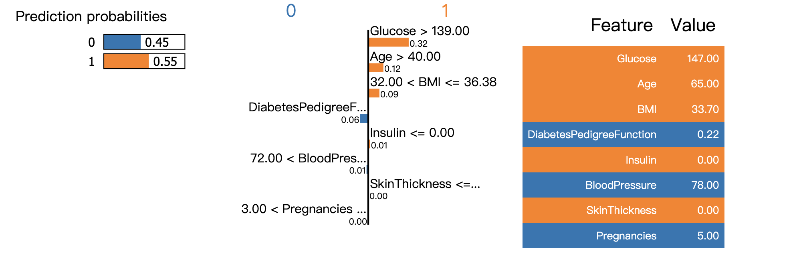
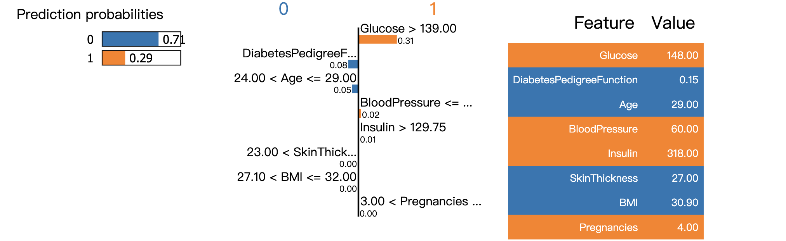
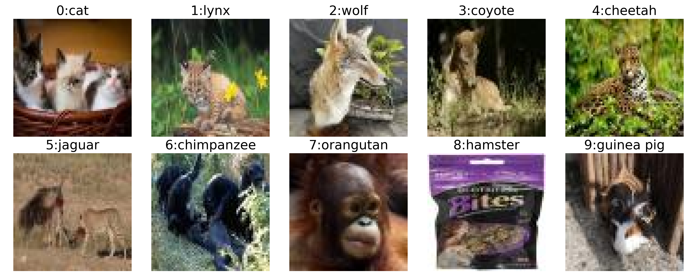
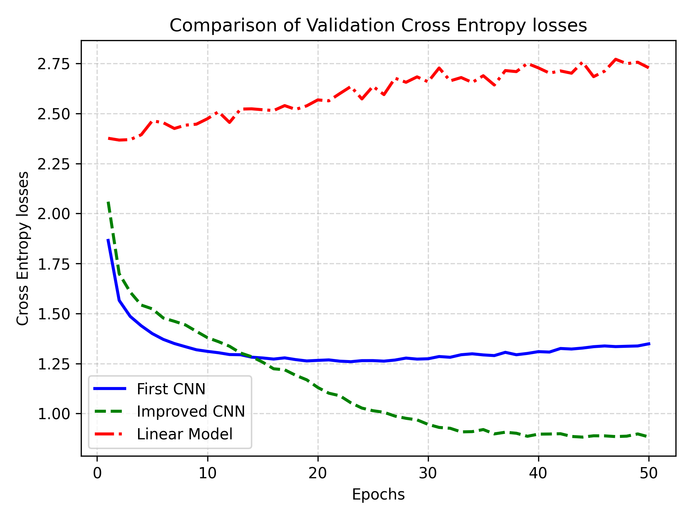
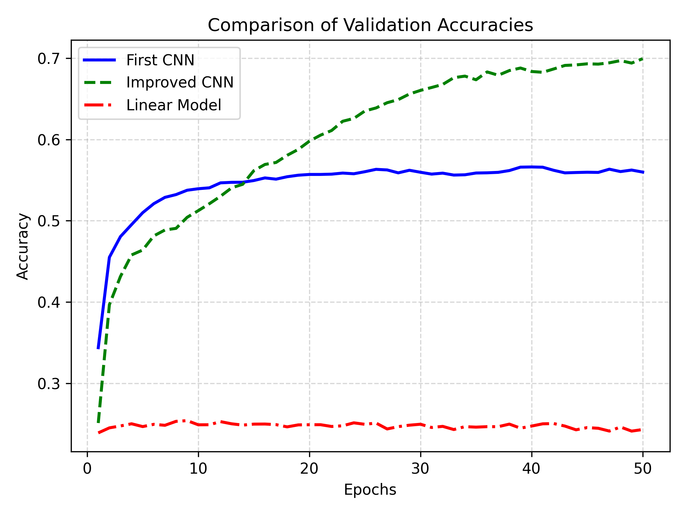
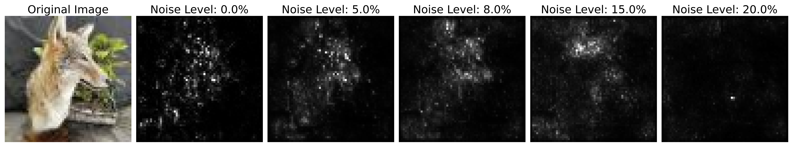
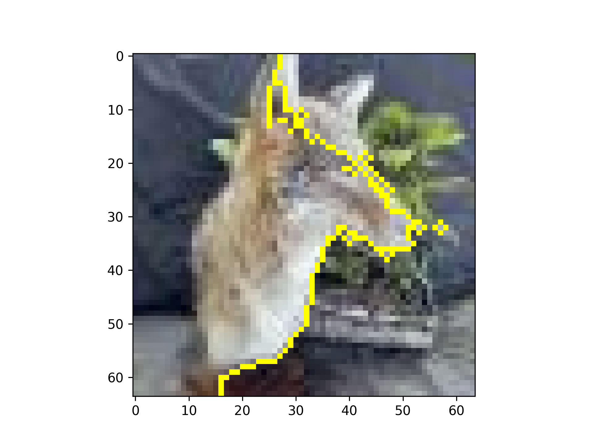
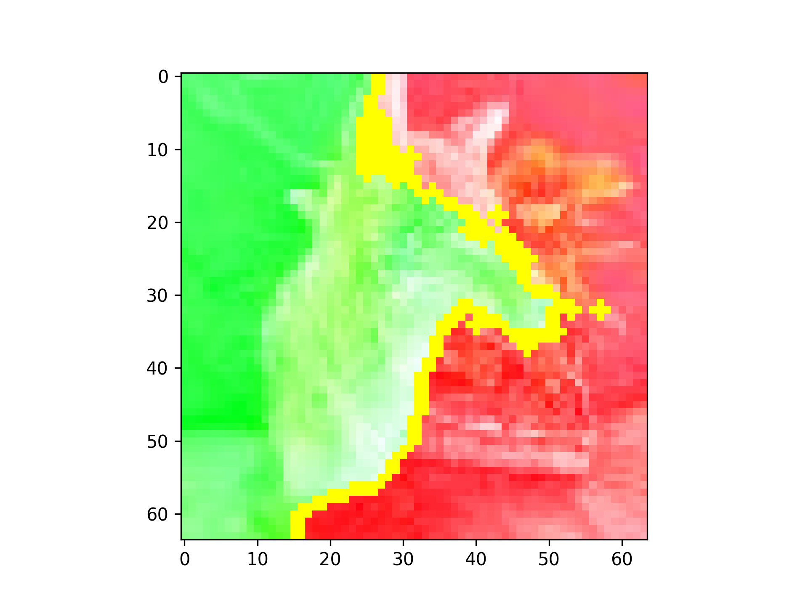

# Introduction

## Dataset

We have two data sets here:

- **Pima Indians Diabetes Database:** The objective of this tabular database is to predict the likelihood of a patient having diabetes based on various health diagnostic measures, including blood pressure.

- **Animal-10N Image Classification Dataset:** The ANIMAL-10N dataset is a collection of images belonging to ten different classes of animals. The dataset consists of 50,000 training images and 5,000 testing images.

In this assignment, my primary focus will be on exploring different techniques for interpreting the outputs of different predictive models. 

# Tabular Data

## Balance of the dataset

This is a medical data set with the outcome value of 0 indicates there is no diabetes, and the outcome value of 1 indicates diabetes. I first check the balance of this data set,  and I find out the percentage of patients labeled as diabetic is 34.90%. So I think this data set is a relatively balanced one and we don't need to use the resampling method.

## Features selected by logistic model

First,I run a logistic model on this data set with an L1 penalty to check the features, with C score of 0.02. And the selected Features here are:

| **Feature**     	| **Importance** 	|
|-----------------	|----------------	|
| **Glucose**     	| **0.607049**   	|
| **BMI**         	| **0.158866**   	|
| **Age**         	| **0.078722**   	|
| **Pregnancies** 	| **0.057310**   	|

And the top3 important features are **Glucose**,
**BMI** and **Age**.

## Features selected by Random Forest

Also, I train this model with Random Forest model and use the field `feature_importances_' to access the importance of features. And the selected features now are :

| **Feature ** 	| **Importance** 	|
|--------------	|----------------	|
| **Glucose**  	| **0.2491**    	|
| **BMI**      	| **0.1717**    	|
| **Age**      	| **0.1518**     	|

And we can see that it shares 3 common features with previous model.

## LIME

LIME generates explanations by approximating the underlying model with an interpretable model. And I use LIME to explain the random forest model. Since it can only consider one data point at a time, I pick the 9th point from this dataset at random and let LIME explain this datapoint for me: 

{#id .class width="100%" height="50%"}
As shown from the graph, LIME provides us with the prediction probabilities of outcomes(0,1). And it shows 0.45 probability of no diabetes (0) and a 0.55 probability of having diabetes (1). The results from the middle part are the  coefficients of each variable. For example, we can explain it as when the patient’s Glucose is larger than 139.0, the Glucose will have an importance of 0.32 on predicting the outcome 1. And when the age is bigger than 40, then the feature Age will have an importance of 0.12 on predicting outcome 1 also. Finally, according to the right result of this graph, we can tell that the three most import features are **Glucose**,  **Age** and **BMI** for this data point. 

And LIME is unstable across different datapoints. Because when I try other datapoints, the selected feature might be different:

{#id .class width="100%" height="50%"}

Although the results are different across different datapoint, I try many different data points and conclude that the top 3 features selected by LIME are more likely to be **Glucose**,
**BMI** and
**Age**. Also,  LIME is a really good method to provide local explanation on a specific data point. 

## Compare Feature selected by three models

Here is a table of all outcomes: (Only consider the 9th point by LIME)

| Feature                  	| Importance - Logistic  	| Importance - RF 	|Importance - LIME 	|
|--------------------------	|---------------------	|---------------	|-------------------	|
| Glucose                  	| 0.607049            	| 0.2491        	| 0.32              	|
| BMI                      	| 0.158866            	| 0.1717        	| 0.09              	|
| Age                      	| 0.078722            	| 0.1518        	| 0.12              	|
| Pregnancies              	| 0.057310            	| 0.0777        	| 0.01              	|
| SkinThickness            	| 0                   	| 0.0657        	| 0.00              	|
| Insulin                  	| 0                   	| 0.0753        	| 0.00              	|
| DiabetesPedigreeFunction 	| 0                   	| 0.1229        	| 0.06              	|
| BloodPressure            	| 0                   	| 0.0859        	| 0.01              	|

As we can see from the results, they all selected Glucose, BMI, Age as the top 3 important features. And Glucose seems to be the most important feature selected by all methods.

# Predictive Modeling on Animal Images

## load data

I first load the data, and visualize an example image from each class in the training dataset, and we can see from this example that this data contains noise data (In below label 8).

{#id .class width="100%" height="50%"}

## linear model

I then train a linear model on the animal classification dataset for 50 epochs. And as for this model, I use a learning rate of 0.001 and a batchsize of 256. As for the optimizer, I'm using Adam with weight_dacay of 3e-4. Although linear model is fast to train, the results doesn't look good. I can only achieve about 25% accuracy on the test data. And the validation loss is about 2.728. This bad result is under my expectation, because images contain features that can't be captured simply by a linear model. Then I plan to train 2 more CNN models and I will show the graphs together later.

## First Vanilla deep convolutional network

My first CNN has 2 convolution layers and 2 fully connected layers. And I use the ReLU activation function as my activation function. I also apply dropout regularization with a probability of 0.5 to the output of the first max pooling layer. I also train the first CNN model on the animal classification dataset  for 50 epochs. This time, the training takes much longer time to train on my device, and finally I get to achieve about 56% accuracy on the test data and the final validation loss is around 1.338. 

## Tune this CNN

To tune this network, I use the following methods: Adding more Convolution Layers, adding Batch Normalization Layers to normalize the activation of the corresponding convolutional layers across the batch dimension. And I also apply some more Dropout Layers helping to prevent overfitting. This network is a really big one, so I use kaggle's accelerator to train this. After 50 epochs of training, I get to achieve about 70% accuracy on the test data and the final validation loss is around 0.883242. 

## Compare these models

{#id .class width="50%" height="50%"}{#id .class width="50%" height="50%"}
As we can see from the result, my improved CNN is the best model. It can achieve the lowest validation loss and the highest validation accuracy. And the linear model is the worst. 

During training, I find many hyper-parameters are important for learning, for example:

- learning_rate is important, it can't be too big or too small. 

- The Number of Epochs is also important because all models need enough training.

- The Batch norm layer is important because it do the normalization and improve training speed.  

- Dropout layer is also important since it prevents overfitting, after applying dropout layers, the result is greatly improved. 

- Network Architecture is also important, bigger network is able to learn better although bigger network means more computational expensive.

And also,  optimizer, Kernel size, activation function are important to our training. 

# Feature Atribution on Animal Images

## SmoothGrad

Then, I run SmoothGrad on my final convolution model to produce a series of heat map of the gradient on the image showing what pixels SmoothGrad is selecting on. And here I show my results.

{#id .class width="100%" height="50%"}

Here, I choose a wolf(labeled as 2) to show my result. Under small level of noise, the heat map of the gradient on the two image will show the feature selection result. And mainly the facial part and part of the body part are selected by this method. But as noise level goes higher, the feature will have more uncertainty and it is then harder for me to tell the result. 

## LIME

I also try to use LIME to select the feature on the same picture of wolf. As we can see from the result showing below, LIME also select features from the face and body part of wolf. As we can see from the picture on the right, the green area represent the part that will increase the probability of predicting this specific label while the red part will decrease the probability. And the entire face and body of this wolf is in the green area.

{#id .class width="50%" height="50%"}
{#id .class width="50%" height="50%"}

## Common features

Although I only show 1 example, I actually play around it on other animals also. I further find out LIME and SmoothGrad seem to focus on facial features of cats and seem to focus more on the body and head of jaguars and coyates also. Therefore, we have the reason to believe that the facial part and the body part of wolf, coyote, cat and jaguars are the common features been selected by SmoothGrad and LIME. 
