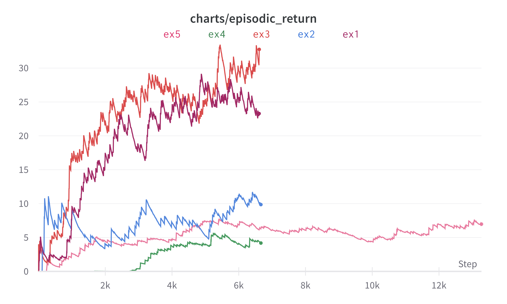
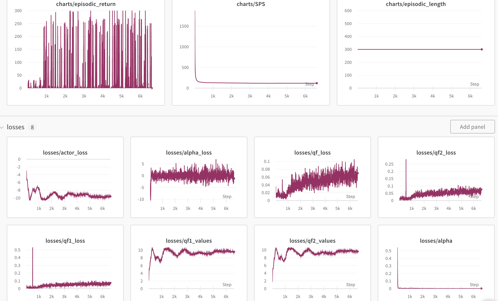
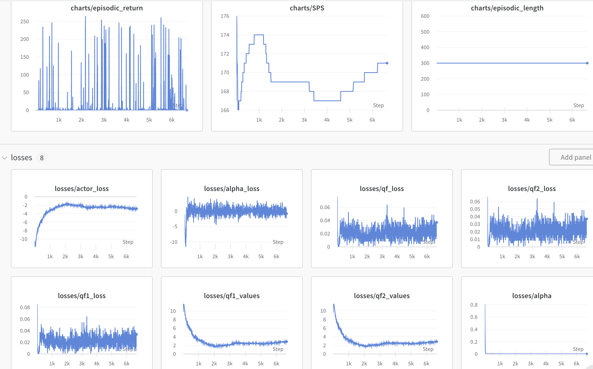
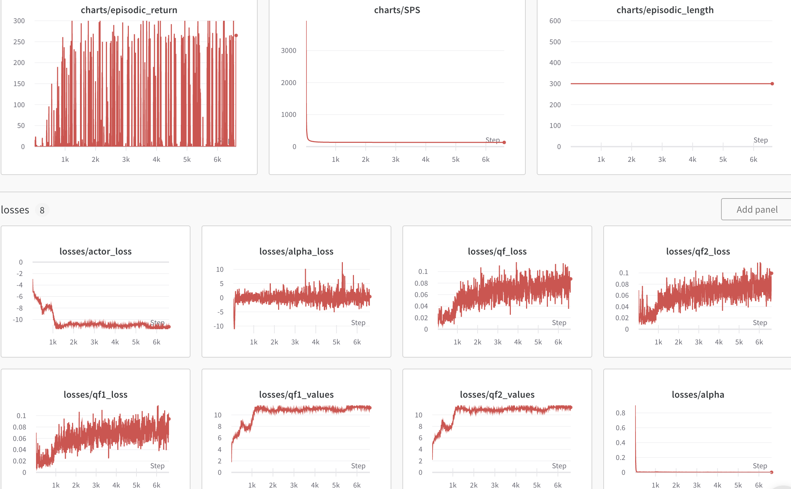
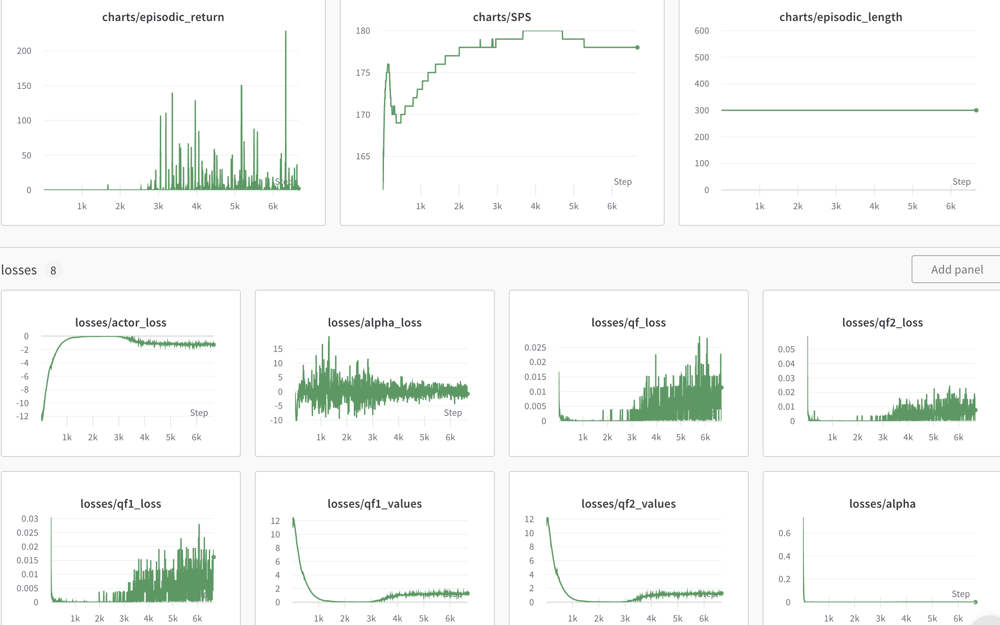
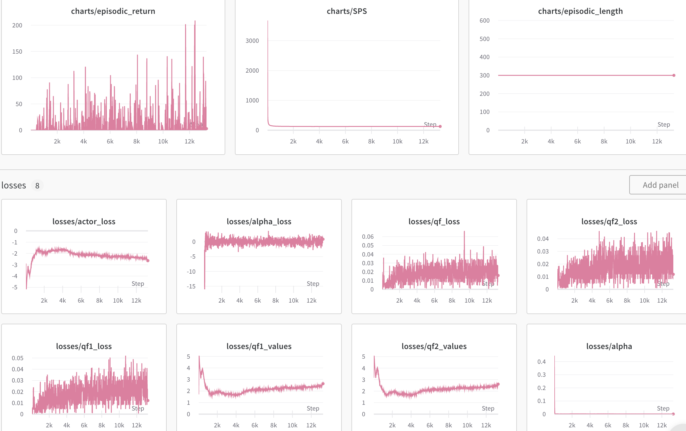

# All result



## Experiment 1
No corruption zone, and the goal is set every where. Train the game with SAC. 
```episodic_length = 300```, ```global_step = 500000```



The agent is getting better at reaching the goal when training with sac.

## Experiment 2
No corruption zone, and the goal is set only from the corruption zone.
Use the trained parameters from experiment 1 to continue training the game with SAC.
```episodic_length = 300```, ```global_step = 500000```



The agent can learn from previous experiment and try to reach the goal in a small area.

## Experiment 3
A small corruption zone, and the goal is set every where. Train the game with SAC.
```episodic_length = 300```, ```global_step = 500000```



This graph is similar to the graph in ex1, but it is hard to tell whether the agent can 
reach the goal in the cor zone. 

## Experiment 4
A small corruption zone, and the goal is set only from the corruption zone.
Use the trained parameters from experiment 3 to continue training the game with SAC.
```episodic_length = 300```, ```global_step = 500000```




The agent can't learn to reach the goal from corruption zone with the trained model from ex3.
But it seems that the agent can learn to reach the goal after another big round of training.

## Experiment 5
A small corruption zone, and the goal is set only from the corruption zone.Train the game with SAC. 
```episodic_length = 300```, ```global_step = 1000000```



The agent is getting better at reaching the goal in the cor zone when training with sac. Although the performance 
is not as good as that of reaching the goal in normal area.


