# Introduction

## Dataset

We have two data sets here. 'raw_state_data_drunk_driving' contains demographic measures for all 50 states in the US. And 'census-tracts-dataset' consists of 20,000 data points that resemble the underlying distribution of the 50 states in the US.
And there is no missing data here. I split the data with 80% for training and 20% for testing.

# Linear Models

## Basic Linear Model

I first train a linear model that takes all of the columns in the census-tracts-dataset and tries to predict the percentage of drunk driving accidents. And standardization is not a strict requirement for linear models. I also try to perform linear model on both scaled data and the original data, and find out the same MSE score on the test data. So I will not use standardization later. After performing linear model, I get Mean Squared Error of 50.76, Correlation coefficient of 0.5607, and R-squared score of 0.3143 on the test set. They all indicate that this model is not a good fit.

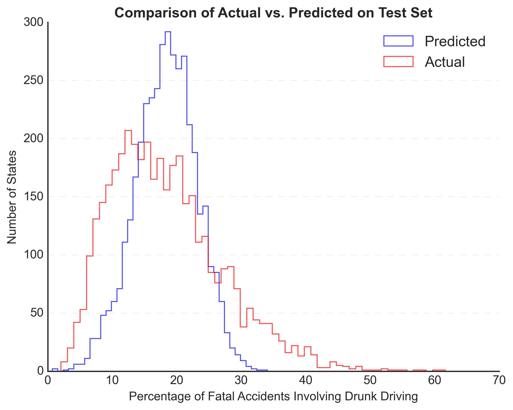{#id .class width="60%" height="50%"}

Then I make this plot to compare the the drunk driving percentage in the data set and to the predictions made by my linear model.The plot indicates that the two groups have different mean and variance, and the actual histogram appears more flat compared to the predicted histogram, it suggests a discrepancy between the predicted values and the actual values. 

Then it occur to me that maybe there exists some problem with the model assumption that the error term should be independent and follow a normal distribution, so it is necessary to check the histogram of the residuals.

So here's the histogram of the linear model errors:

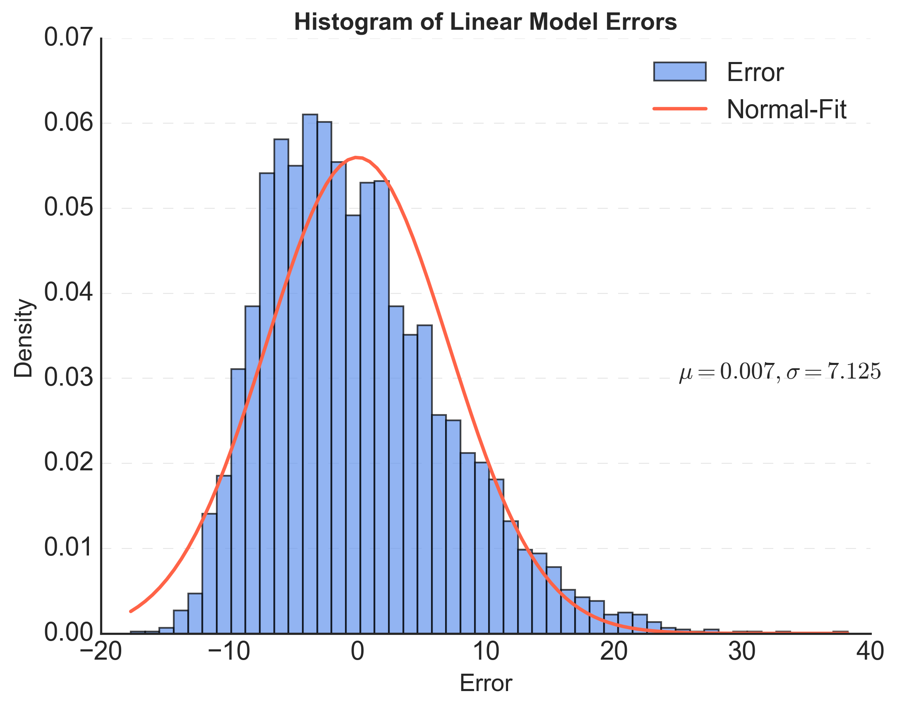{#id .class width="60%" height="50%"}

As shown above, the error distribution appears to follow a normal distribution but is slightly skewed to the left, it suggests that the model has some bias that consistently underestimates the target variable.

## L1 and L2 penalties

Considering there are 23 variables, so I plan to add L1 and L2 penalties to the linear model. After using **GridSearchCV** to search for the best parameters, I find out the best $\alpha$ for lasso regression is 0.01 and the MSE on the test set is 50.7636. The best $\alpha$ for ridge regression is 100, and the MSE on the test set is 50.7633. Compared to the MSE in the simple linear model, we can see there is no big improvement. 

# Random Forrest

In this analysis, I implemented the Random Forest algorithm using the default parameters provided by the **RandomForestRegressor** module, with a specified random_state value of **42**. The resulting Random Forest model achieves a mean squared error of 46.43 and the Correlation coefficient id 0.6079 on the test set. After using **GridSearchCV** again, I find out the best parameters for Random Forest here is **max_depth** of 20, **min_samples_split** of 2 and **n_estimators** of 300. However, the final MSE is 46.293, and the Correlation coefficient is 0.6157 on the test set, which is not improved that much. 

And actually, I find out the **random_state** has the biggest influence on this regression. Maybe because each random_state value will lead to a different set of randomly selected samples, random splits in decision trees, or random initialization of model parameters. 

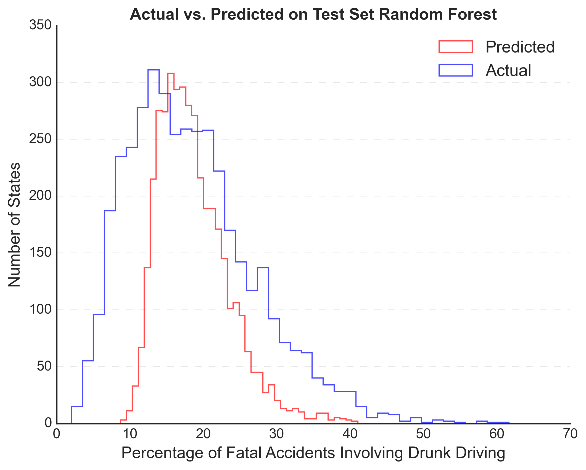{#id .class width="50%" height="50%"}
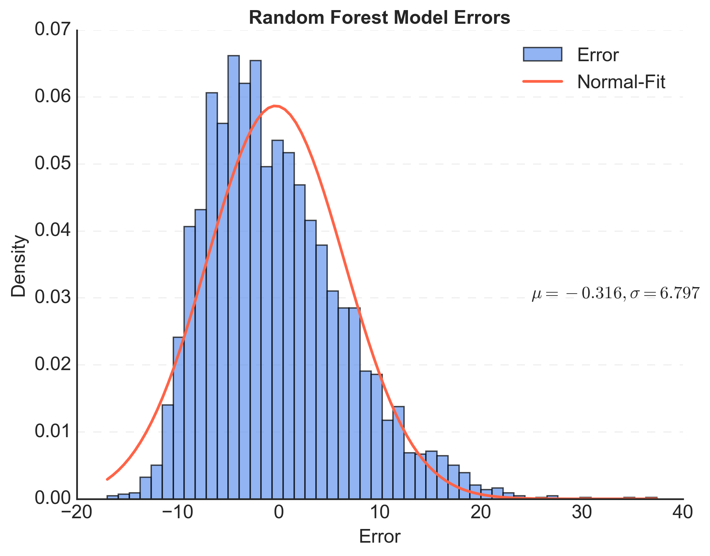{#id .class width="50%" height="50%"}

Compared to the result in the linear model, I get smaller standard deviation in error but a little larger $\mu$. Also, the MSE is smaller then the linear models and the Correlation coefficient is larger. Also, from the histogram, it is evident that the predicted distribution obtained from the random forest model aligns more closely with the actual percentage distribution compared to the linear model. They all show that random forest is of better performance.

# Neutral Network

## First simple Neutral Network

Initially, I implemented a simple neural network with three layers and the Sigmoid activation. However, the performance of this network was not satisfactory, with even much worse results compared to previous models. The MSE on the test set was found to be 74.523, also shown below: 

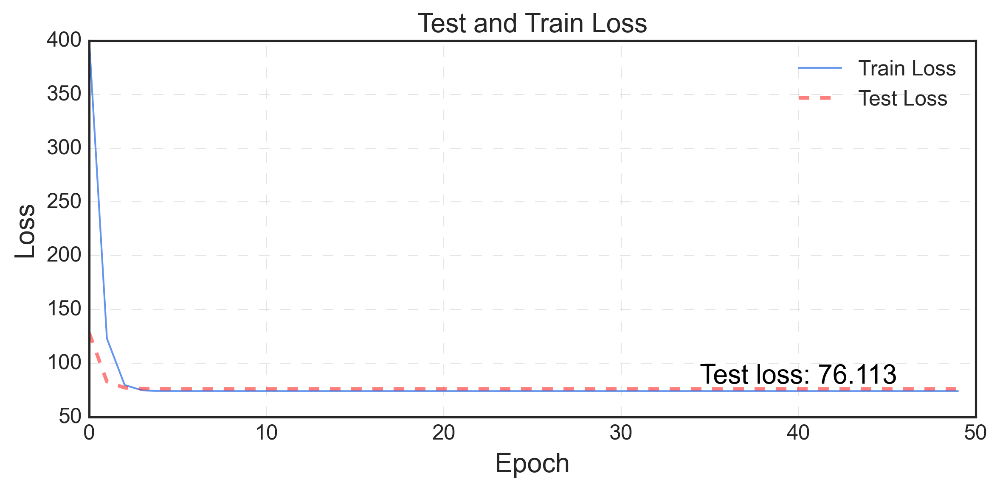{#id .class width="100%" height="50%"}
And I also plot the histogram:

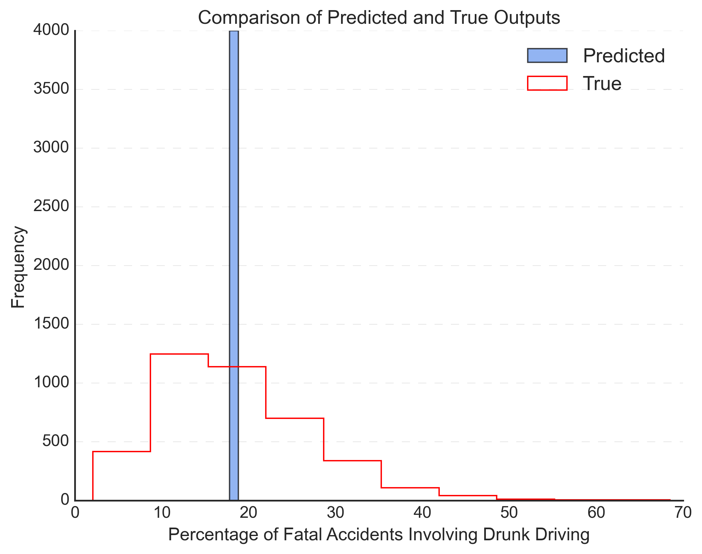{#id .class width="60%" height="50%"}

As shown in the plot above, when comparing the histograms of the predicted outputs with the true distribution, it is evident that the neural network tends to converge to the mean output. This consistent problem might be attributed to the usage of the Sigmoid activation function in the neural network. Because it sometimes can cause the gradient to vanish or explode when the input values become very large. This can result in the outputs being pushed towards the extremes of 1 or -1, leading to predict the mean all the time.

## Tune the Net

Then I use the tricks below to improve this:

- Increase the **hidden layer size** to 128
- Change the activation function to **Relu**
- Add a **batch-norm** to the Neural Network
- Change the optimizer to **Adam** and with **Weight_decay** and **smaller learning rate**
- Increase training epoch

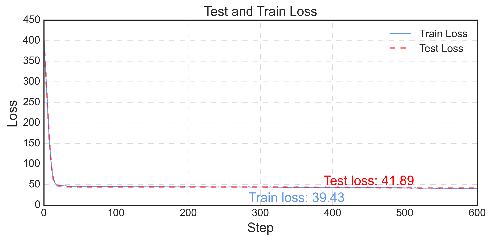{#id .class width="100%" height="60%"}

My final model is a Neural Network with a Batch normalization layer and Activation function of Relu. 

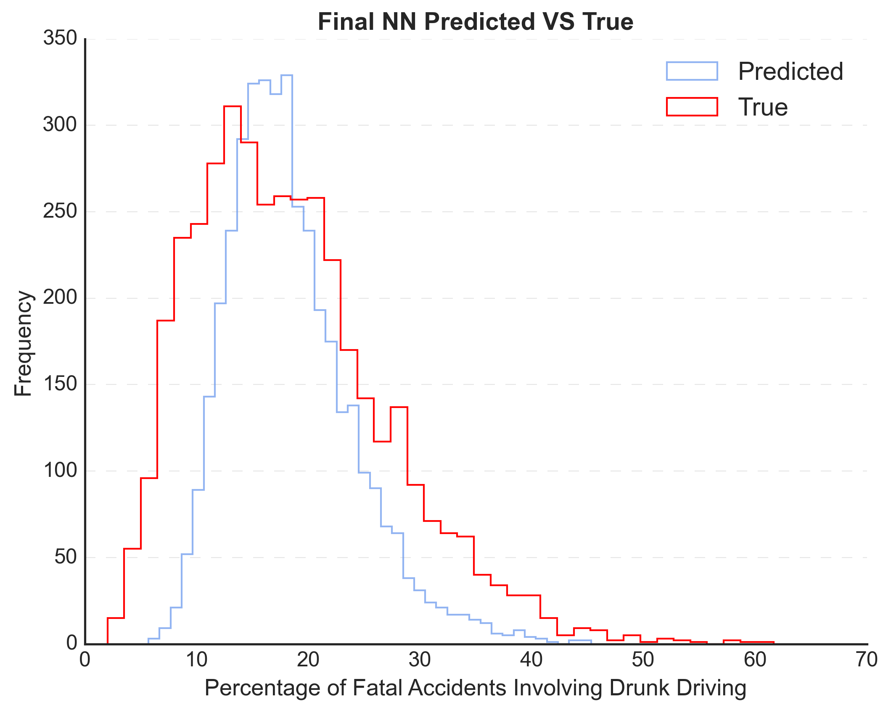{#id .class width="50%" height="50%"}
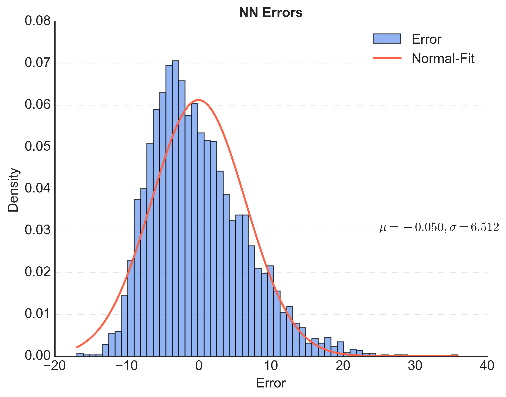{#id .class width="50%" height="50%"}

It achieves a MSE of 41.89 on the test set and Correlation coefficient of 0.6617. And after tuning, Neural Network can have the best performance compared to all models previously.

# Transfer Learning

## Train models on small data set

This part, I will be working with the real data set to make prediction. I first train multiple models on this small data set. The MSE for the linear model is 93.138, and R-square score is -0.65, meaning the linear model doesn't fit well here. The MSE for Lasso with alpha 10 is 67.78 and R-square score is -0.15, meaning the not good fit also. When using Random Forest, the MSE on the test set is 62.36, and R-square score is -0.05, also not good. And as for the Neural Network, the MSE on the test set is about 120.14 and on the train set is 6.78. This result is reasonable because Neural Network usually needs big data set. And transfer learning can help train Neural Network models with small datasets, which I will try later.

## Transfer Learning on Linear model and Random Forest

Before performing transfer learning on Neural Network, I perform the transform learning on linear model and random forest. First, I train the linear model on the large dataset. Then, I will use the trained linear model to make predictions on the data from the small dataset. The MSE here is 1643.55, and R-square is -22, indicating a very bad result. Similarly, the MSE on Random Forest is 147.14, which is also not good. Therefore, I think these two trained models do not transfer very well.

## Transfer Learning on Neural Network

Then I try to implement transfer learning on the neural network. I first train the neural network on the large data set until it converges, and then I continue to train the trained neural network on the small dataset for a shorter epoches. To compare with NN without transfer learning, I will use the same group of test set. To better compare the results of transfer learning, I will compare to the NN result on the small data set without transfer learning.

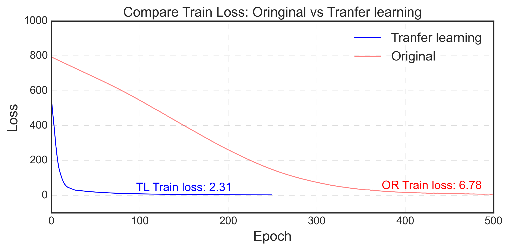{#id .class width="100%" height="50%"}

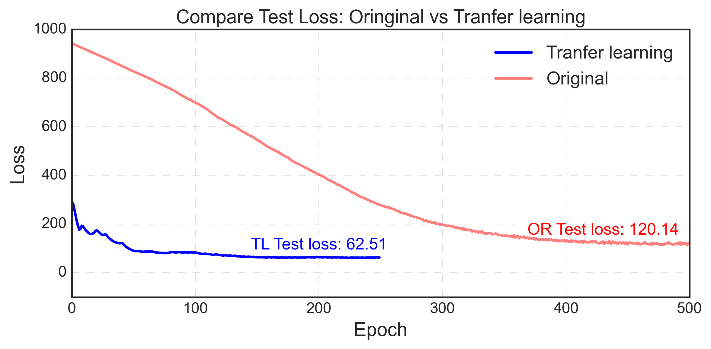{#id .class width="100%" height="50%"}

The results above indicate that while the model may not perform exceptionally well on its own, the utilization of transfer learning has proven to be beneficial. When doing training on the pre-trained model, both the test loss and the train loss converges more quickly compared to the original loss curves and will achieve a better result in the end. The final MSE loss shows that it will make a more reasonable prediction on this small data set compared to the original neural network model.

# Visualization

In this section, I begin by visualizing the percentage of drunk driving accidents in each state using a Choropleth map of the United States.

{#id .class width="100%" height="50%"}

Next, I apply the previous Transfer learning Neural Network to make predictions. I then calculate the absolute value of residuals and visualize them. 

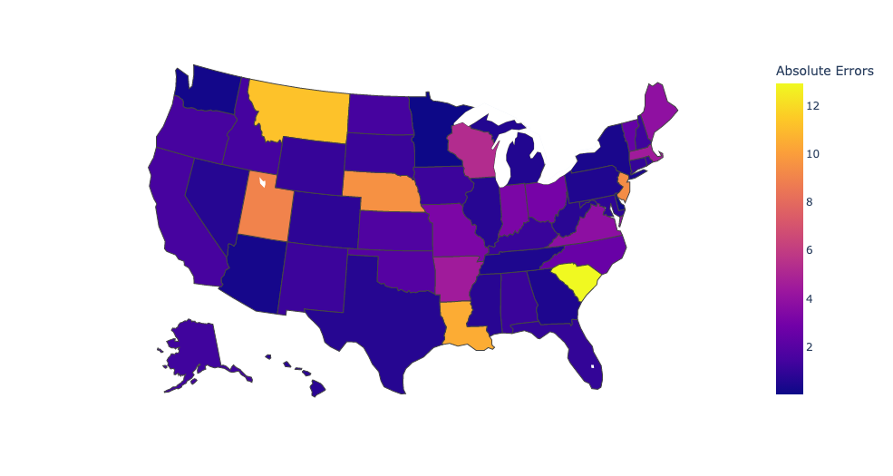{#id .class width="100%" height="50%"}

As we can see here, our model provides a good representation for most states. However, there are a few states that stand out, namely Montana (MT), Louisiana (LA), and South Carolina (SC), which appear to be the most challenging to predict accurately.
