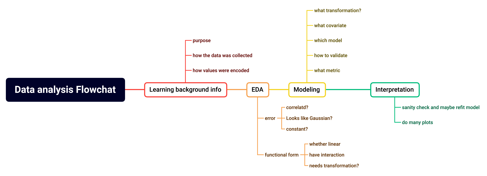

# [Advanced Statistical Model](https://github.com/hanshuo-shuo/DS-project/tree/main/Statistics%20model)
- Multilevel Modeling (MLM) and Longitudinal Data Modeling are statistical techniques for analyzing complex data structures. MLM, also known as hierarchical linear modeling, is used for data that has a hierarchical or nested structure, considering the inherent variability at each level.
-  Longitudinal data modeling, which includes mixed-effects models, generalized estimating equations, growth curve models, and survival analysis, is utilized for analyzing data collected over multiple time points. 
-  Generalized Linear Models (GLM) provide flexibility for analyzing data with different types of distributions. 
-  These techniques have a wide application in dealing with practical data scenarios, including missing values and non-linear relationships. 
-  Model selection methods such as AIC, BIC, stepwise regression, and cross-validation aid in determining the most suitable model for a given dataset.

# Useful links

- [Data sceience interviews](https://github.com/alexeygrigorev/data-science-interviews/tree/master)
- [Starter Code for Collab Filtering](https://www.kaggle.com/code/vishorita/best-recommendation-collabarative-filtering?scriptVersionId=119356689)
- [Starter for content filtering](https://heartbeat.comet.ml/recommender-systems-with-python-part-i-content-based-filtering-5df4940bd831)

# DA

