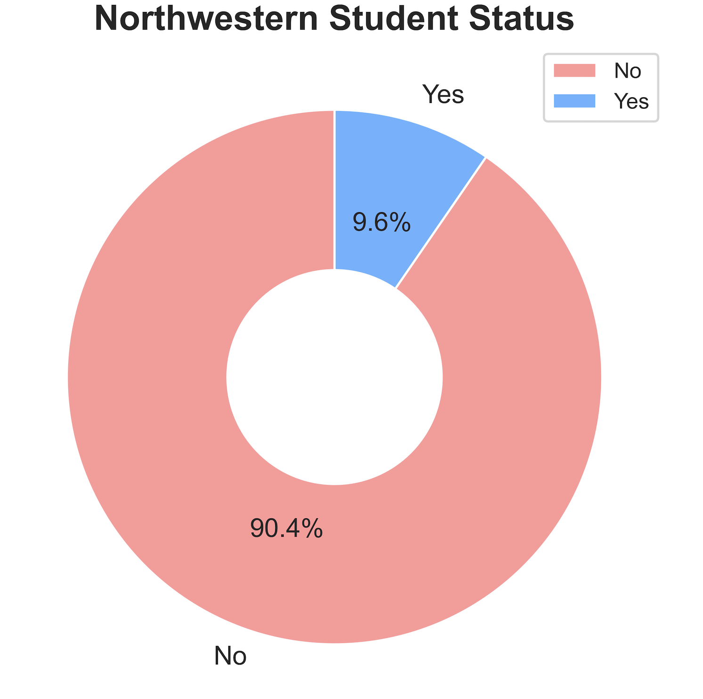
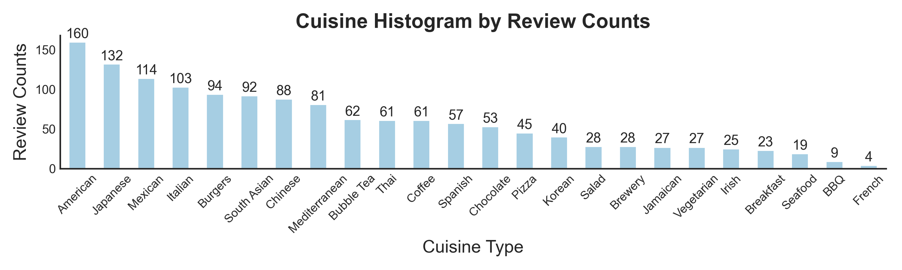
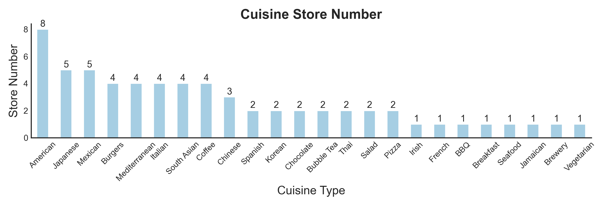
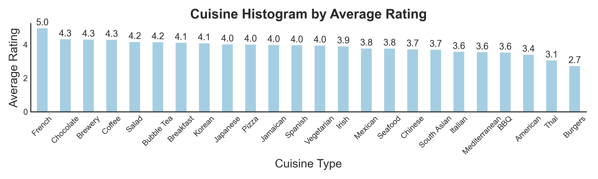
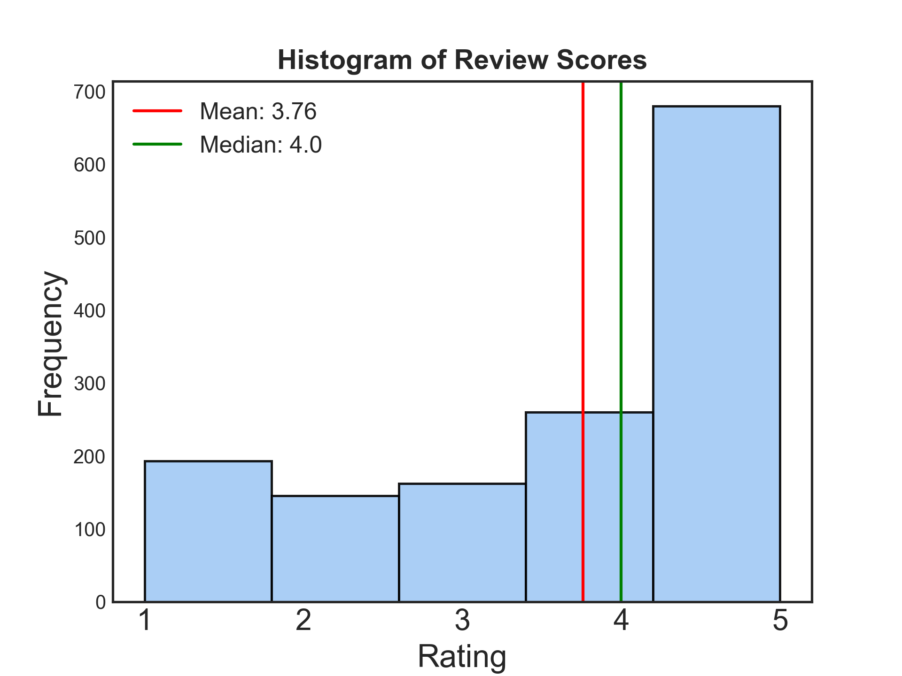
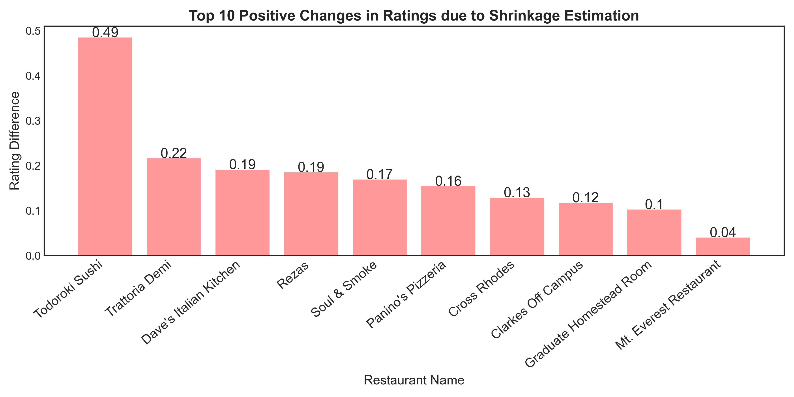
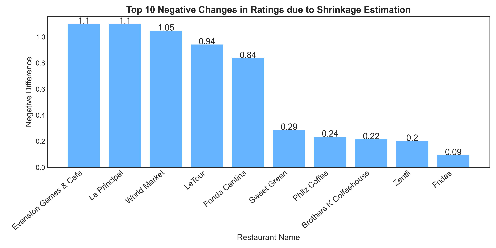
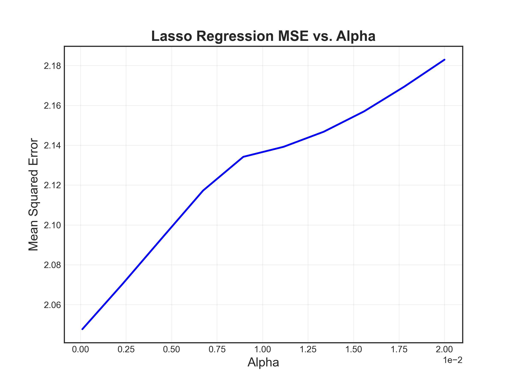
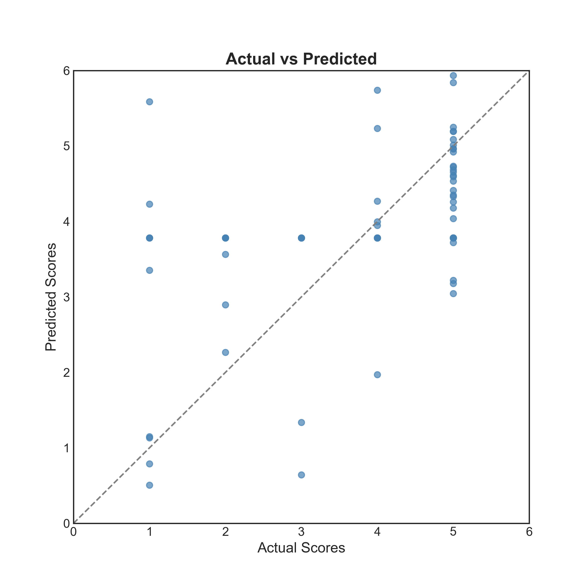

# Introduction

## Dataset

We have two data sets in this homework. One is a review data set with people's review features in it. The other is a restaurant data set with all restaurants' information in it.

The primary goal of the assignment is to gain insight into different systems of recommendation. And in the end we will try to build a model to predict the rating score of a restaurant. 

# Data cleaning and preprocessing

## Dealing with missing values and outliers

First I check whether there are some outliers in Weight, Height and Birth year and find out no obvious outliers. Afterwards, I check whether there are missing values and find out in Review data set:

| Variable | Number of Missing| Variable | Number of Missing|
| --------------|--------| --------------|--------|
|Review Text|550|Birth Year|2|
|Marital Status|35|Has Children?|38|
|Vegetarian?|1350|Weight (lb)|97|
|Height (in)|54|Average Amount Spent|2|
|Preferred Mode of Transport|7|Northwestern Student?|  1|

And Restaurant data set has no missing values.

Since 'Average Amount Spent', "Northwestern Student?" and "Birth Year" has very small number of missing values(Only 1 or 2), I just drop them. And I fill in the null value in 'Review text' with a space, the null value in 'Marital Status','Preferred Mode of Transport','Vegetarian' and 'Has Children' with a new category 'Unknown'. 

And to deal with 'Weight' and 'Height'(There are a lot of missing.), since there are strong relationship with these two variables by life experience, I first fit a linear model 'Weight ~ Height', and use the model to fit the missing 'weight' with no missing 'height'. Then I fit a 'Height ~ Weight' model and use this model to fit the missing 'height' with no missing 'weight'. Afterwards, I use the mean value to fill in the people who has both missing 'weight' and 'height'. 

## Abnormal Value and some typo Erroe

Then I check the typo error in the data set. I find out a restaurant name has is not correct. I change it form "Clare's Korner" to "Claire's Korner". Also, the Marital Status has one mistake and I change it from "SIngle" to "Single". 

# Analysis

## Simple Visulization Analysis

I make some histograms to try and better understand the data distribution. What I find most interesting is the distribution of **Northwestern Student**.

{#id .class width="50%" height="50%"}

As we can see, only about 9.6% reviewers are northwestern students. This is such a low proportion then I expected. Maybe students eat more at their school cafeteria. 

Then I try to understand the distribution of cuisine type from 3 demensions:

{#id .class width="100%" height="50%"}
{#id .class width="100%" height="50%"}

{#id .class width="100%" height="50%"}

If we just look at the specific cuisine in Evanston, American cuisine has the biggest proportion and there is only one French restaurant, one BBQ and one sea food etc. Together with the cuisine type by review counts, a bigger store numbers in Evanston also seems to show a bigger review number in that cuisine type, which is a good sign. When I try to identify the average rating of specific type of cuisine, I realized most cuisine have the average at around 3-4. French has the highest rating, probably due to only one French restaurant in Evanston and very few reviews as well. And Thai and Burgers seems to have the lowest average rating. 

## Clustering

After choosing 'Birth Year', 'Weight', 'Height', 'Northwestern Student?' etc as my demographic features and scaling the featured data, I apply the ELBOW method and find out the best cluster number for K-means should be 5 here. 

|Cluster|Rating Mean|Birth year Mean|Weight Mean|Height Mean|
|------|-----------|-------------|-----------|----------|
|1  |  3.806202| 1957.14|208.42|158.98|
|2  |  3.903030|1992.95|200.09|184.25|
|3  |  3.501992|1970.16|274.73|179.22|
|4   | 3.991150|1993.97|177.11|159.20|
|5  |  3.461832|1969.24|170.96|180.15|

And I realize people in cluster 3 and cluster 5 tend to give lower rating compared with people in other clusters. People in cluster 3 and 5 have the average birth year at around 1970 and height at around 180.0. People in cluster 3 have the highest average weight while people in cluster 5 have the lowest average weight.

## Popularity matching

{#id .class width="50%" height="50%"}

We can see from the histogram that there are more good rating(4 or 5) counts compared with bad rating(1 0r 2) counts. The average review score is 3.76 and the median review score is 4.0. Restaurant: LeTour, Evanston Games & Cafe, World Market, La Principal and Fonda Cantina have the highest average score of 5.0. And Campagnola and Chipotle	are the top 2 who has received the largest quantitiy of reviews. 

I also build a simple engine to recommend a restaurant if we give it a cuisine type based on the rating:

|Input Cuisine|Recommend Restaurant|
|---------------|----------------------|
|Spanish|Tapas Barcelona|
|Chinese|Peppercorns Kitchen|
|Mexican|Chipotle|
|Coffee|Pâtisserie Coralie|

However, when doing recommandation, the review count is also an important feature. So I use shrinkage estimators to combine these two features together. Recall from the slice, I need to calculate following: $\alpha = min(\frac{N_{p}}{N_{\mu}}, 1)$, and the estimator: $(1 - \alpha)\mu_s + \alpha \mu_p$. $N_p$ is the total number of reviews of a particular restaurant in Evanston. In this formula, $N_{\mu}$ is the mean value of reviews, $\mu_p$ is the mean rating for a particular restaurant based on people's reviews and $\mu_s$ is the average rating in the entire data set. In real life, shrinkage estimator is used a lot in recommandation. After applying the shrinkage estimator method on Rating, some restaurants' Rating have changed a lot:

{#id .class width="100%" height="50%"}

{#id .class width="100%" height="50%"}

While some restaurants benefit from it, some get hurt by it. According to the results, restaurants with low rating and low review counts trend to benefit from this, while restaurants with high rating and low review counts trend to get hurt from this. 

Overall, to regularize a recommendation system's ratings, we can apply "shrinkage" that shrinks the ratings of less popular items towards the overall mean. This helps to prevent the system from being biased towards popular items, which could lead to inaccurate recommendations.

## Content based filtering

After applying one hot encoding to the data in the restaurants table, I also did feature scaling, since both euclidean distance and cosine distance are sensitive to the scale in features. Then I use the data to compute the euclidean distance and cosine distance between every restaurant. 

Then I write a script that takes a user, first it finds out the user's favorite restaurant based on his previous rating, and then find out similar restaurants using euclidean or cosine distance. To compare these two distances, I try to play with the script with different distances settings. Here I choose the user Aaron Hall, who likes to eat Elephant & Vine the most. Based on this result, we will recommend:

|               **User: Aaron Hall**              	|         **Favorite:Elephant & Vine**         	|
|:-----------------------------------------------:	|:--------------------------------------------:	|
| **Top 5 Recommandation by euclidean distance** 	| **Top 5 Recommandation by cosine distance** 	|
|                    Oceanique                    	|                   Oceanique                  	|
|                 Barn Steakhouse                 	|                    LeTour                    	|
|                      LeTour                     	|                Barn Steakhouse               	|
|                      Alcove                     	|                    Alcove                    	|
|                    Campagnola                   	|                  Campagnola                  	|

As we can see, both matrices offer similar recommendations.

## Natural language analysis

In this section, I first build a Jaccard matrix where the element $D_{ij}$ refers to the Jaccard distance between restaurant i's augmented description and restaurant j's augmented description. 

Then I compute the TF-IDF score for each restaurant's Augmented Description. And when given the word 'cozy', the system I write tells me the restaurant **Taste of Nepal**. When given the word 'Chinese', it tells me **Lao Sze Chuan**. Then I check the description in the table and find out **Taste of Nepal** has description: South Asian eatery known for momo dumplings. Cozy food. And **Lao Sze Chuan** has description: Modern Chinese mainstay, known for an extensive selection of classic entrees in a stylish airy interior making it a festive space. We can see 'cozy' appears in the description of **Taste of Nepal**  and 'Chinese' also appears in the description of **Lao Sze Chuan**. 

I also make a list of the 100 most popular words in the Augmented Description column and use that list to compute the TF-IDF distance matrix. And finally I use BERT to compute the Embedding-Distance matrix. 

In terms of which distance metric does the best under this proposed comparison method, it is hard to say without testing the method on the specific data set. To test the performance of these three matrix, I play with it for a little bit. I choose a random restaurant, and let it recommend three other restaurants for me using different matrices. For example when I choose the Chinese restaurant **Lao Sze Chuan**, the output goes like:

| **Recommendation by Jaccard matrix** | **Recommendation by TF-IDF matrix** | **Recommendation by Embedding matrix** |
|------------------------------------|-------------------------------------|-----------------------------------------|
|              Kabul House             | Kabul House                         | Peppercorns Kitchen                     |
|               Oceanique              | Peppercorns Kitchen                 | Shangri-La Evanston                     |
|            Joy Yee Noodle            | Joy Yee Noodle                      | Joy Yee Noodle                          |                   	|

And when I choose the coffee store **Philz Coffee**, it goes like:

| **Recommendation by Jaccard matrix** | **Recommendation by TF-IDF matrix** | **Recommendation by Embedding matrix** |
|:------------------------------------:|-------------------------------------|-----------------------------------------|
|                Le Peep               | 5411 Empanadas                      | Evanston Games & Cafe                   |
|            5411 Empanadas            | Pâtisserie Coralie                  | Pâtisserie Coralie                      |
|              Jimmy Johns             | Evanston Games & Cafe               | Brothers K Coffeehouse                  |                        |

From the table above, it seem that the Embedding matrix is the most accurate one. Because **Lao Sze Chuan** makes SzeChuan Chinese food, and the recommendation it gives also contains restaurants with similar kinds of food. 
And the recommandation it gives for **Philz Coffee** are also all coffee places. But Jaccard matrix and TF-IDF matrix are not that accurate. I also did other experiment to examine this and find out that in this situation: Embedding matrix is the best while Jaccard matrix is the worst. And this is just a rough conclusion, more examinations is needed.

## Collaborative Filtering

In this section, our aim is to develop a user-based collaborative filtering recommendation system. The system will identify users with similar demographic information and reviews, and provide recommendations based on their similarities. And I'm considering two methods to compute this similarities. First, I will use the demographic feature to form a matrix. After removing duplicated reviewers, I did one-hot encode together with the feature scaling. Then I use this vector and cosine distance to compute the similarity matrix. With this matrix, I come up with my first simple recommendation system. When given an input name, it will tell me 5 other similar people with similar demographic feature. 

For example, when I input **Karissa Corley**, it tells me the other 5 people are **Fonda Wright**, **James Gutierrez**, **Bonnie Willis**, **Kerry Gastelum** and  **Tammie Rowe**. I'm using cosine distance here, and they all have very small distance to **Karissa Corley**. I use the data set to check these people's common feature, I find out they are all not Northwestern student, married without children, and they are all car owners. This shows like this system works well and can gather people with similar feature. 

| **Name**        | **Restaurant**  | **Rating** | **Child?** | **Marital** | **Spent ** | **Transport** | **Student** |
|----------------------|--------------|------------|------------|-------------|------------|---------------|-------------|
| Bonnie Willis   | Jimmy Johns     | 5          | No         | Married     | Medium     | Car Owner     | No          |
| Tammie Rowe     | Fridas          | 4          | No         | Married     | Medium     | Car Owner     | No          |
| Karissa Corley  | 5411 Empanadas  | 5          | No         | Married     | Medium     | Car Owner     | No          |
| James Gutierrez | Union Pizzeria  | 2          | No         | Married     | Low        | Car Owner     | No          |
| Kerry Gastelum  | Kuni's Japanese | 4          | No         | Married     | Medium     | Car Owner     | No          |
| Fred Wright     | Burger King     | 2          | No         | Married     | Low        | Car Owner     | No          |

However, In this example, although they share a lot of features in common, their preference towards restaurants and rating are a lot different. So I use the other matrix to generate recommendation based on their reviews on specific restaurant. 

To create a reliable vector representation of the review history, we must filter out reviewers with less than four reviews. This will ensure that the data used to create the vectors is meaningful and representative. And based on this vector, I form a matrix with its $d_{ij}$ element represents the i's user rating on the j's restaurant. Noticed a lot of blank space in the matrix, I plan to use Singular Value Decomposition (SVD) method to predict the blank with minimize RMSE. SVD has a great property that it has the minimal reconstruction Sum of Square Error (SSE) and also RMSE and SSE are monotonically related.

{#id .class width="100%" height="50%"}

In this context, the matrix X represents the sparse matrix I form, U is a left singular matrix that captures the relationship between reviewers and latent factors. The diagonal matrix S denotes the strength of each latent factor, and V transpose is a right singular matrix that represents the similarity between restaurants and latent factors. And using the SVD in **Scipy**, we get to predict the unseen Rating for a reviewer.

In the end of this part, to compare these two matrices. I put in the user name 
**Karissa Corley** to the recommendation system formed by the review-user matrix, I find out completely different group of people: Karen Hindle	,Kelly Douglas, Thomas Stoney, Jacquelyn Rigatti, etc... And these people all have many similar rating habits(Either have some close ratings to the same group of restaurants or tend to rate similar scores.) to the user I put. 

So I think in this situation, review-user matrix might do a better job at recommending similar users compared to the demographic matrix. This is also intuitive, because the system should care more about what the user likes to eat rather than what the user's demographic information similarities. 

## Predictive modeling

Since Rating score is of significant importance when it comes to recommendation system. If we can find out some way to predict the Rating score, that would be nice. In the linear model that takes demographic data, along with the cuisine type for a restaurant to do the prediction : After spiting the data set with the training and test set of (8:2), it has an MSE of 2.05 and R2 score of  0.13 on the test data set. Both number indicating that this model does not fit well. 

To improve this, I then try add an L1 penalty to the linear regression model.

{#id .class width="60%" height="50%"}

However, form the graph we can see the model is better without L1 penalty.

Additionally, recall from previous part that BERT embeddings seems work well. I utilized BERT embeddings to encode the review descriptions provided by the consumers. Since here, the missing review descriptions contains no information, I decided to drop the missing values and split the dataset. As a result, I achieved an MSE of 1.73 on the test set, and the R2 score is 0.2, which is much better than fitting the model with demographic characteristics and L1-penalty. 

After performing linear regression on both demographic and natural language information, the resulting mean squared error is 1.92. Adding the natural language information will improve the modeling but the best thing here is to predict Rating just based on language information without any demographic feature. 

I use the best linear model(Rating just based on language information) so far to do visualization on test data set: 

{#id .class width="60%" height="50%"}

We can see even the best model here doesn't perform well since the scatter points are not centered around the gray line, but they should be cloes to the gray line when in good fitting model.

In the end, I want to know what demographic features are useful for predicting coffee scores. And to build the regression model, I only use data from four coffee shops, namely 'Brothers K Coffeehouse', 'Philz Coffee', 'Pâtisserie Coralie', and 'Evanston Games & Cafe'. According to the coefficient of this model, 'Has Children?_No: 0.420034' and 'Northwestern Student?_Yes: 0.402113' seem to have the biggest two positive weights. While 'Has Children?_Yes' seems to be the biggest negative factor. Showing that people without children and Northwestern students tend to give coffee store higher rating. 

## Interesting Things

- Unusual Users: A person called **Melody Smith**. All his Ratings are 1. Apart from that, he also gives the bad review text to the store **Evanston Chicken Shack**. It is weird that since he doesn't like that store, why does he go to that place for 15 times within a month and keep giving bad comments all the time? This might happen if this comment is given by people another fried chicken restaurant who wants to bring shame on **Evanston Chicken Shack**. As far as I know, this is a really good one and I go there frequently. Another user called **Karissa Corley** who gives 36 reviews in total. And 35 of them are Rating 5 while one of them is rating 1 on **Cross Rhodes**.

- Northwestern Students tend to give slightly higher rating than Non Northwestern Students. The former has average rating of 3.914 while the latter has average of 3.73. And they have larger proportion of going to restaurants on foot, Single and has no children. Also, according to the weight, Northwestern students have lower mean weight(191.9) compared to the non Northwestern (205.4), indicating rate of obesity might be lower in students group.

# Summary

In this assignment, we explored different systems of recommendation and built a model to predict the rating score of a restaurant. Through this process, we gained valuable insights into the workings of recommendation systems and their potential applications in various domains. 

It seems that the prediction doesn't look quite good so far, so in the future, there are two ways to improve on this. First, we can try to collection more data. Here we only have about 1450 reviews, but in real life, we are facing millions of reviews. Second, we can perform more advanced machine learning algorithms for building recommendation system, such as deep learning models. It may be useful to explore ensemble methods or hybrid models that combine multiple algorithms or techniques for better performance. 
